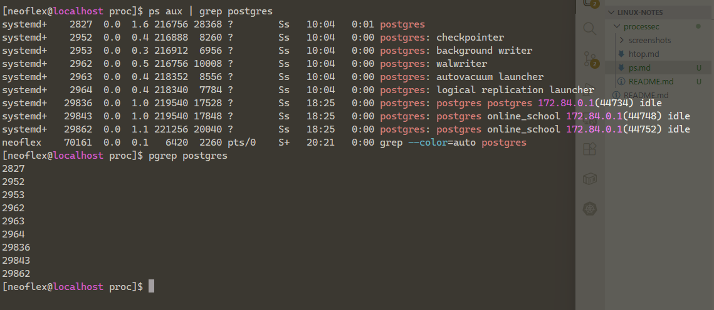
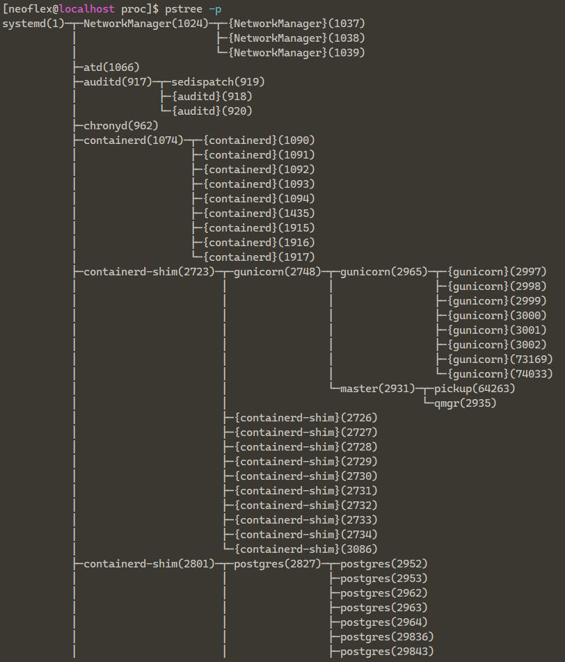

# PS / PGREP

### PS AUX
a - процессы всех юзеров
u - подробный формат
x - включая процессы без терминала

### PGREP
pgrep -i postgres - получить PID и имя процесса 

### LS - CAT /proc/1234
Узнать детали об файле можно через директорию и информацию в ней
cat /proc/1234/cmdline - команда запуска
cat /proc/1234/environ - окружение
cat /proc/1234/limits - лимиты
и так далее

### Дерево процессов 
pstree / pstree -p

