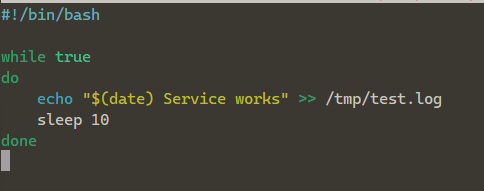
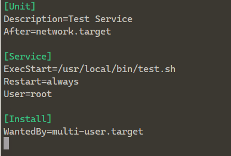
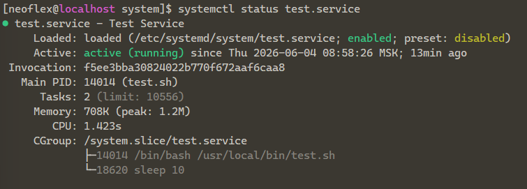

# Unit

## Unit - это обьект, которым управляет systemd. 

Помимо service (служб) бывают еще:
1) Timer unit (.timer)
[Timer]
OnCalendar=daily #Каждый день запускать опредленный сервис
Persistent=true
Systemctl list-timers

2) Target unit (.target)
Target - это группа других unit-файлов.
systemctl get-default - проверка текущего таргета

3) Socket Unit (.socket)
Позволяет запускать сервис только при обращению к сокету.
Если юзер подключается к ssh, то при обращении к 22 порту, запускается ssh.service

4) Mount Unit (.mount)
Управляет монтированием файловых систем
[Mount]
What=/dev/sdb1
Where=/data
Type=ext4

5) Automount Unit (.automount)
Позволяет монтировать диск только при обращении

6) Path Unit (.path)
Следит за файлами и каталогами 

## Добавленеи своего сервиса (скрипта) в автозагрузку

## 1. Создание тестового скрипта 

## 2. Перейти в /usr/local/systemd/system и создать serivce unit

## 3. Загружаем новый unit 

- systemctl daemom-reload - говорит systemd перечитать все unit файлы
- systemctl start test.service - запуск сервиса
- systemctl enable test.service - добавление сервиса в автозагрузку

